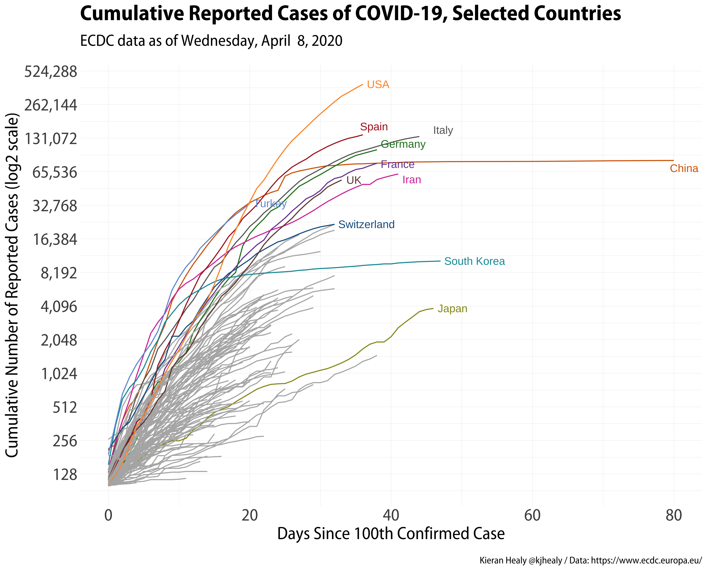
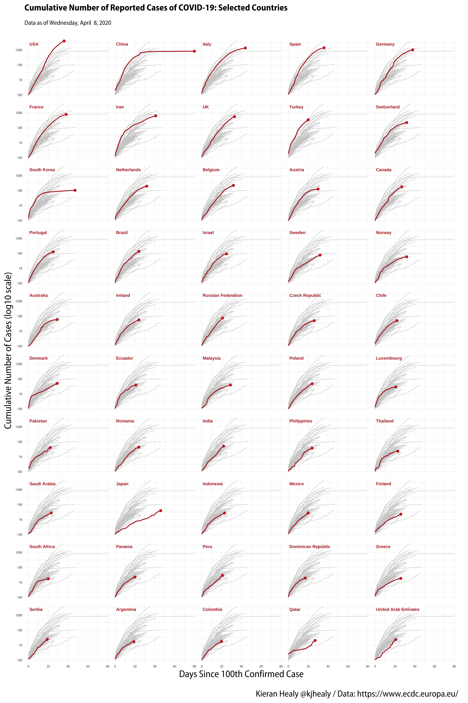
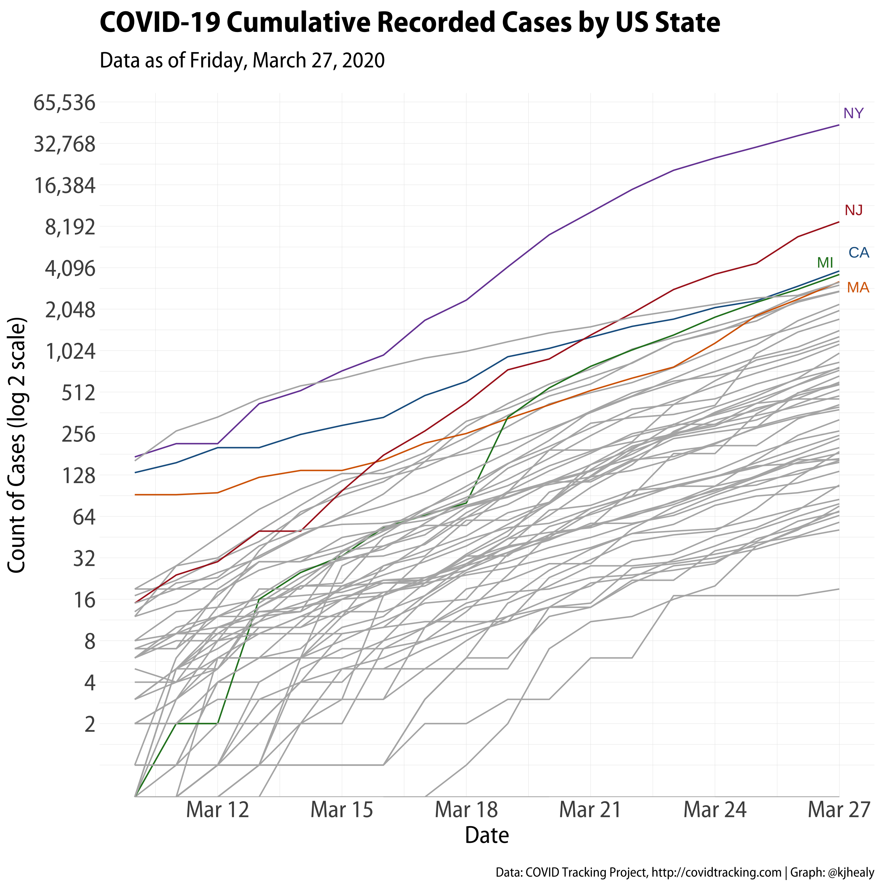

# covid
## Kieran Healy

The inevitable COVID-19 repo. No amateur epidemiological modeling here, just a couple of functions to get current cumulative data from the [https://www.ecdc.europa.eu/en](ECDC), clean it a little, and then plot current trends. Also US State-level estimates collated by <https://covidtracking.com>. 

